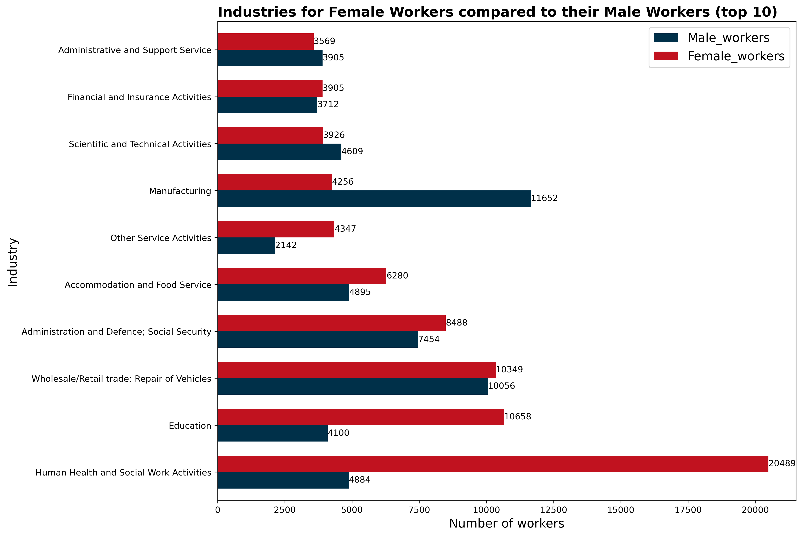
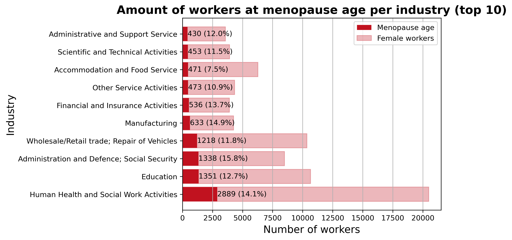

# AC Industry Research
Analysing which local industries have the highest amount of women workers for research purposes

This data is from the 2022 Scotland Census for the Fife area only

## Top three industries for female workers
|Industry|Female workers|
|---|---|
|Human Health and Social Work Activities|20489|
|Education   | 10658 |
|Wholesale and Retail trade; Repair of Motor Vehicles and Motorcycles|10349|

## Bar chart of top 10 industries for female workers
Sorted by highest female workers, with male workers included for ratio comparison.

## Top three industries for menopause aged female workers
|Industry|Female workers|
|---|---|
|Human Health and Social Work Activities|2889|
|Education   | 1352 |
|Public Administration and Defence; Compulsory Social Security|1338|

## Bar chart of top 10 industries for female workers of menopause age
Sorted by highest amount of menopause aged workers.

Bars with a percentage higher than 12.86% have an above-average amount of menopause age workers.

### Good targets for Menopause education 

- Human Health and Social Work activities

The highest amount of menopause workers are in this industry and they have a slightly higher than average amount of menopause age workers.

- Administration and Defence; Social Security

Has the highest percentage of menopause age workers, although it doesn't have as many workers as other industries it will has a significant amount.

### Poor targets for Menopause education 

- Accommodation and Food Service
Has the lowest percentage in the chart with 7.5%, almost half the average.
